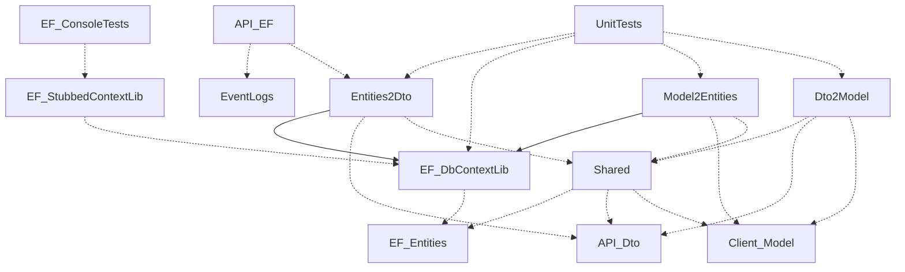

# Web API StudentEvaluator

# Introduction

StudentEvaluator_API_EF est une API RESTful conçue pour simplifier la communication entre le site web et l'application Android du projet StudentEvaluator. Son objectif principal est de faciliter la gestion des évaluations, des modèles, des utilisateurs et d'autres données essentielles de manière efficace...

# Diagramme de paquetage 

# Ce que l'on a fait pour le premier jalon
### Fonctionnalités :

- Liaison Modèle <-> DTO
- Liaison Entités <-> DTO
- Liaison Modèle <-> Entités
- Journalisation (API et EF)
- Injection de service
- Injection / indépendance du fournisseur
- Pagination & Filtrage (Exemple : GetEvaluationByTeacherId)
- Requêtes CRUD sur des données simples et complexes (API et EF)
- Utilisation des relations One-to-One et One-to-Many
- Mappage (Entités <-> DTO)
- Authentification
- Intégration continue (CI)
- Liaison API <-> EF
- Code partiellement documenté

### Tests:

- Tests unitaires - EF (SQLite en mémoire)
- Tests fonctionnels - EF (Sans données simulées)
- Tests unitaires - API sur les contrôleurs (Moq)
- Tests fonctionnels - API (consommation des requêtes)
- Tests unitaires sur les différents "Data Manager" faisant le lien entre DTO, Entités et Modèle
- Tests unitaires sur le Modèle
- Tests unitaires sur les "Translator" permettant de traduire Entités en Dto, etc...

# Ce qu'il nous reste à faire pour le deuxième jalon

### Fonctionnalités :
- Unit of Work
- Repository
- Utilisation dans le projet

### Tests :
- Tests sur les nouveautés

